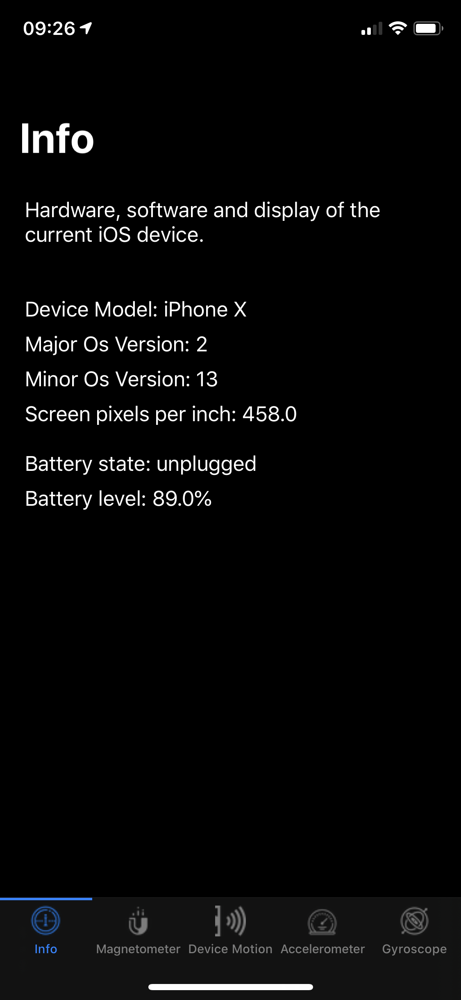
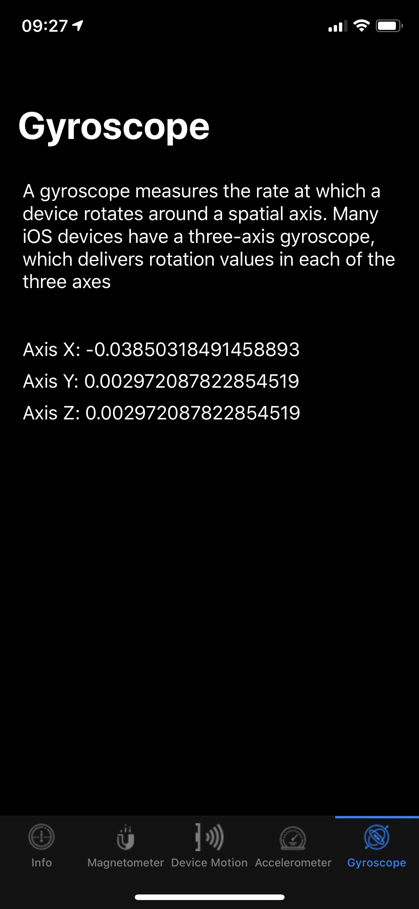

# SampleDeviceAndSensorInfoApp
Sample iOS app which aggregates data from sensors, gets system info and displays it.
supports both dark and light modes.

### How to use this app?

1. Clone this repo
2. Open shell window and navigate to project folder
3. Run `brew install swiftlint` used to cleanup code & ensure codestyle (alternatively remove Swiftlint run phase from project)
4. Run `pod install`
6. Open `SampleDeviceAndSensorInfoApp.xcworkspace` and run the project on selected device or simulator

#### Screenshot:

